# <span style="display: flex; justify-content: center; align-items: center; gap: 30px;">GoScrum</span>

<span style="text-align: center" >
<p>An application whose purpose is to make possible the implementation of "Scrum", as an agile methodology, in different work groups.</p>
<p>This is possible thanks to the fact that the application allows the creation of teams, which each user can join by opting for a "Team Leader" or "Team Member" role.</p>
</span>

## Key features

- 🌙​ Dark mode.
- 🚀​ Team building.
- 🤝​ Join a team using your TeamID.
- ​✔️​ Drag tasks to other boards.
- ✍️​ Edit previously created tasks.

## Preview

### User Registration

- Ligth mode

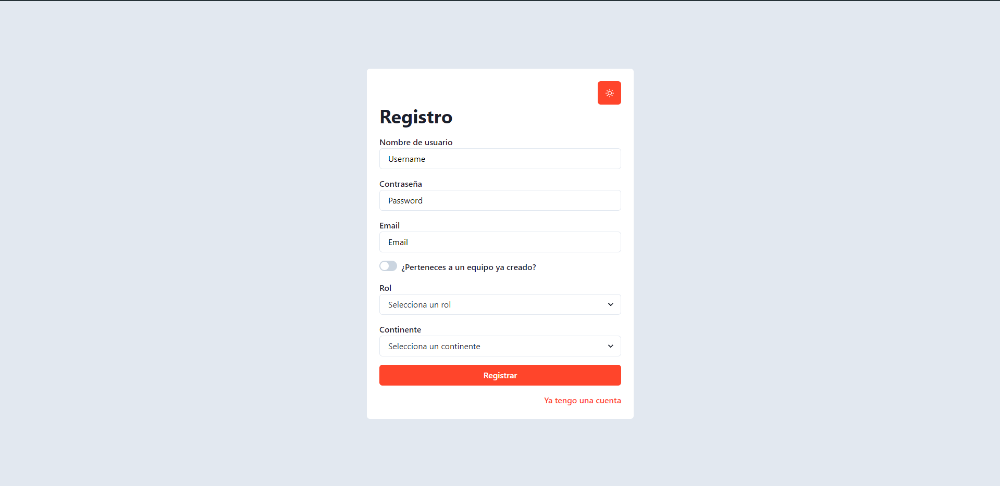

- Dark mode

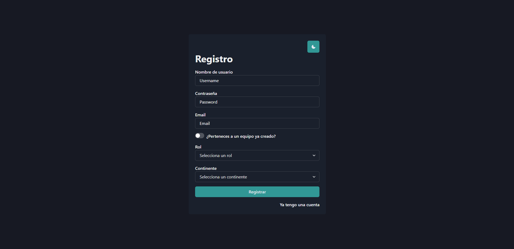
### Login

- Ligth mode

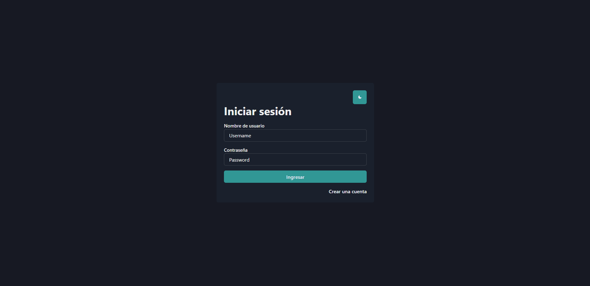

- Dark mode

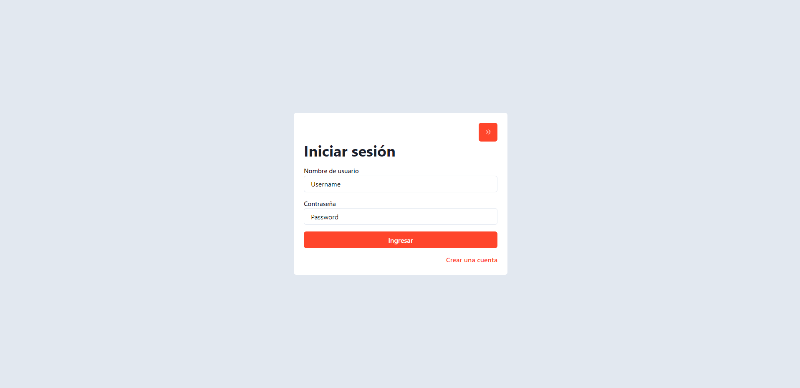

### Home screen

- Ligth mode

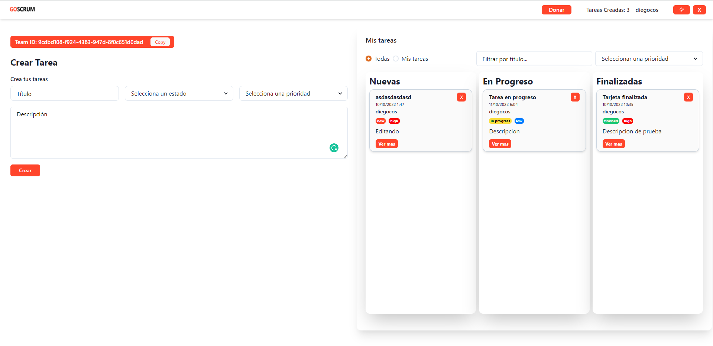

- Dark mode


### Modal to edit tasks


This modal is activated when clicking on the "Ver más" button of each card.

- Ligth mode

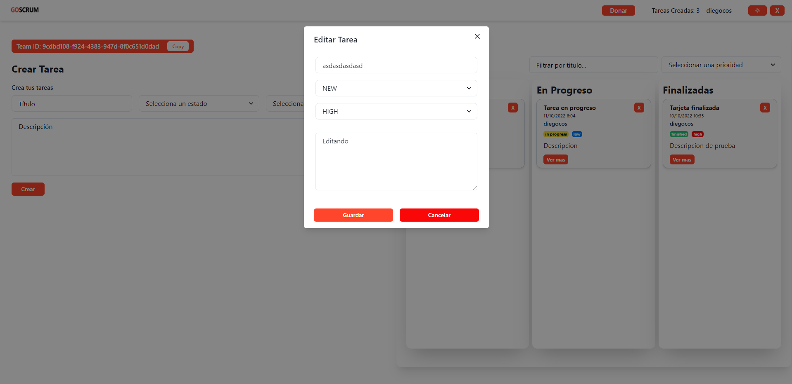

- Dark mode

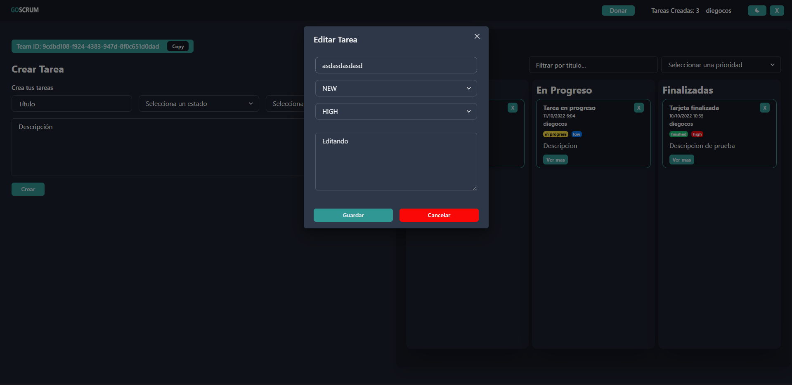

### Drag tasks to other boards

It's possible to drag any task and drop it on the desired board.

- Ligth mode

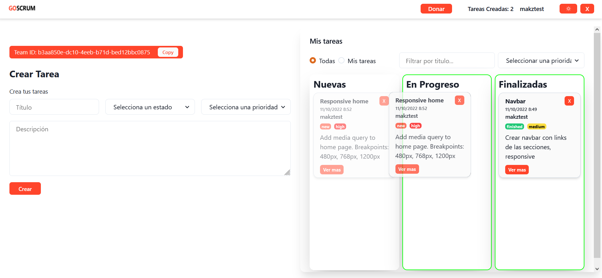

- Dark mode

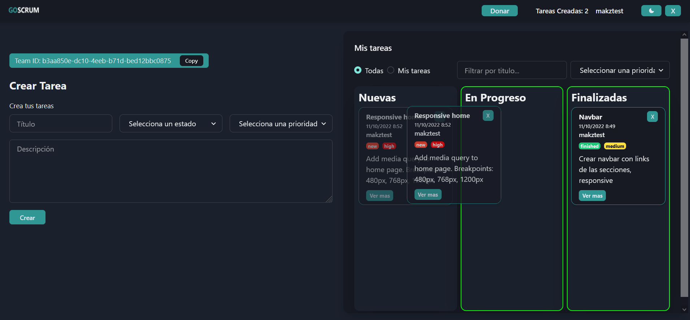

### Alerts

These will become visible when an action is completed correctly or incorrectly, such as: creating a task.

- Success

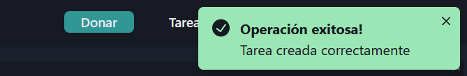

- Error

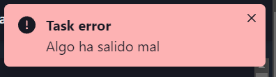

## Installation

To clone this repository, follow the steps below:

```fix
git clone https://github.com/stick2yourmind/GoScrum.git
cd GoScrum
npm install || npm i
```

## Quickstart

To run the project locally (after cloning it):

```fix
npm run dev
```

<span style="display: flex; justify-content: center; margin-top: 40px">

</span>