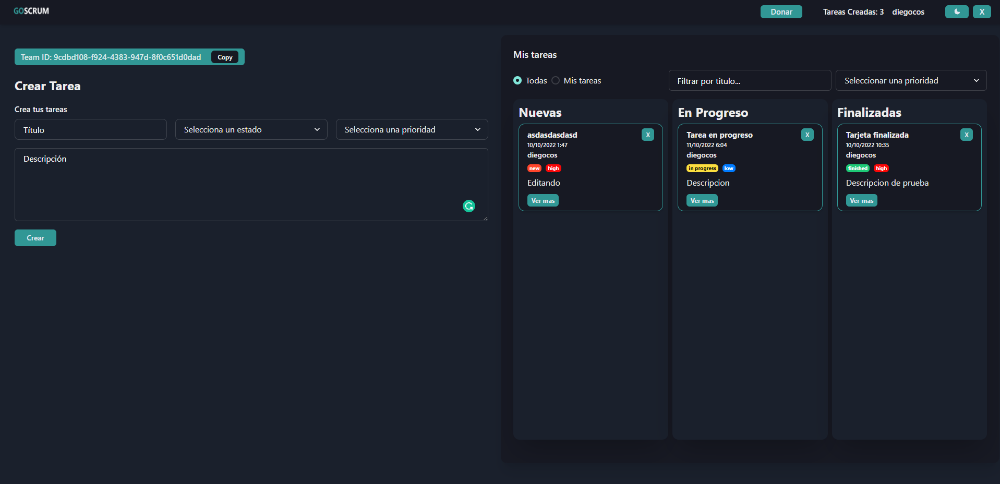

<h1 align="center">GoScrum</h1>

<p align="center">
An application whose purpose is to help the implementation of "Scrum", as an agile methodology, providing a kanban board with drag and drop functionality.
This is possible thanks to the fact that the application allows the creation of teams, which each user can join by opting for a "Team Leader" or "Team Member" role.
</p>

## Key features

- 🌙​ Dark mode.
- 🚀​ Team building.
- 🤝​ Join a team using your TeamID.
- ​✔️​ Drag tasks to other boards.
- ✍️​ Edit previously created tasks.

## Preview

### User Registration

- Ligth mode


- Dark mode


### Login

- Ligth mode


- Dark mode


### Home screen

- Ligth mode


- Dark mode



### Modal to edit tasks


This modal is activated when clicking on the "Ver más" button of each card.

- Ligth mode


- Dark mode


### Drag tasks to other boards

It's possible to drag any task and drop it on the desired board.

- Ligth mode


- Dark mode


### Alerts

These will become visible when an action is completed correctly or incorrectly, such as: creating a task.

- Success


- Error


## Installation

To clone this repository, follow the steps below:

```fix
git clone https://github.com/stick2yourmind/GoScrum.git
cd GoScrum
npm install || npm i
```

## Quickstart

To run the project locally (after cloning it):

```fix
npm run dev
```


<p></p>


<p align="center">

</p>
